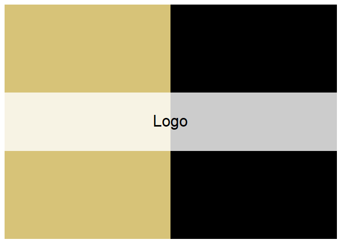
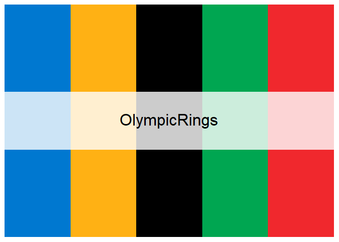
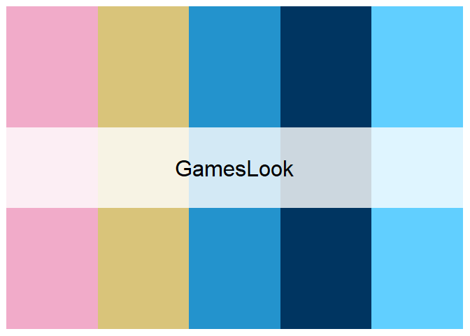
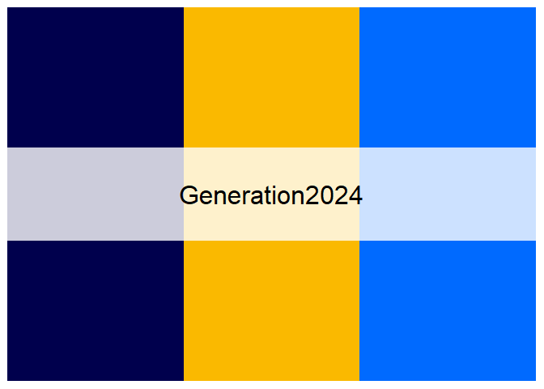
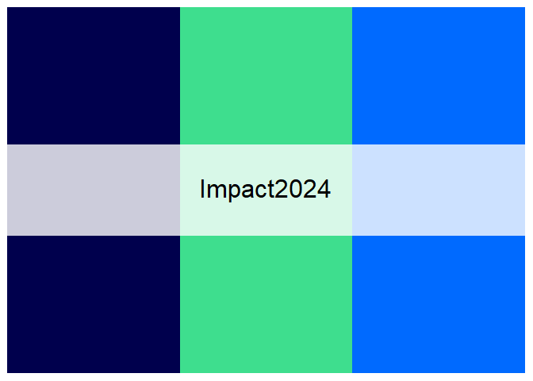
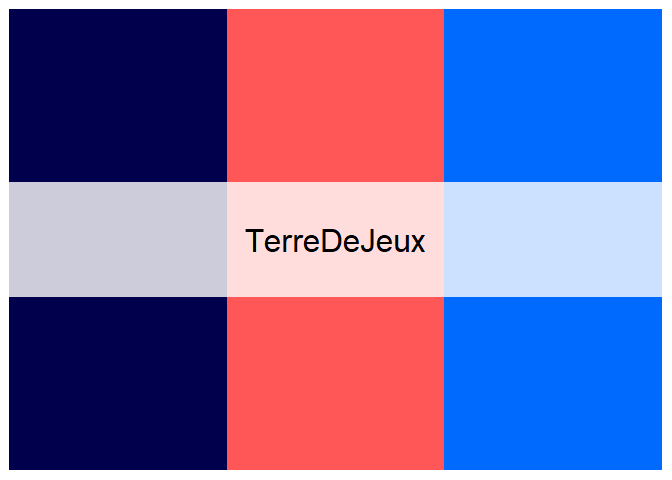
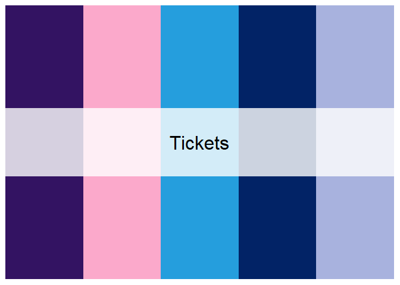
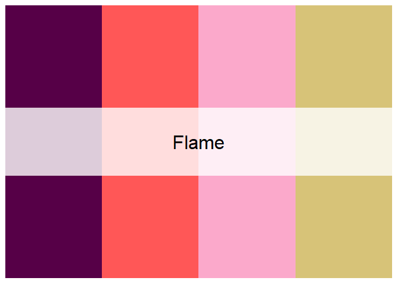

<!-- README.md is generated from README.Rmd. Please edit that file -->

# Paris2024Colours

<!-- badges: start -->

[](https://CRAN.R-project.org/package=Paris2024Colours)
[](https://doi.org/10.32614/CRAN.package.Paris2024Colours)
<!-- badges: end -->

Palettes inspired by Paris 2024 Olympic and Paralympic Games.

This package is inspired by the
[`PNWColors`](https://github.com/jakelawlor/PNWColors) and
[`wesanderson`](https://github.com/karthik/wesanderson) packages.

## Installation

You can install the package from CRAN with:

``` r
install.packages("Paris2024Colours")
```

or the development version of Paris2024Colours from
[GitHub](https://github.com/) with:

``` r
# install.packages("devtools")
devtools::install_github("maximekuntz/Paris2024Colours")
```

## Usage

``` r
library("Paris2024Colours")

# See all palettes
names(paris2024_palettes)
#> [1] "Logo"           "OlympicRings"   "GamesLook"      "Impact2024"    
#> [5] "Generation2024" "TerreDeJeux"    "Tickets"        "Flame"
```

## Palettes

``` r
paris2024_palette("Logo")
```



``` r
paris2024_palette("OlympicRings")
```



``` r
paris2024_palette("GamesLook")
```



``` r
paris2024_palette("Generation2024")
```



``` r
paris2024_palette("Impact2024")
```



``` r
paris2024_palette("TerreDeJeux")
```



``` r
paris2024_palette("Tickets")
```



``` r
paris2024_palette("Flame")
```


