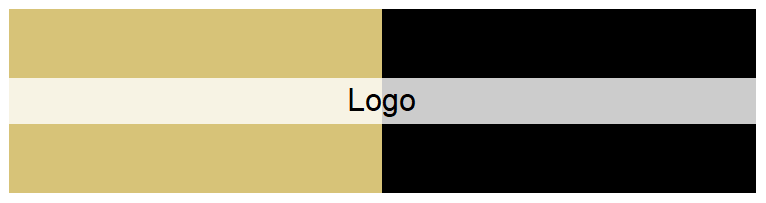
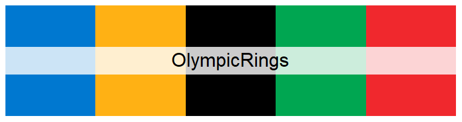
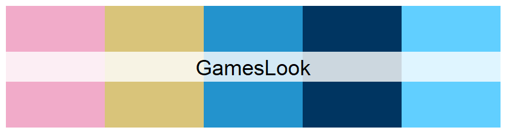

# Paris2024Colours

<!-- badges: start -->
<!-- badges: end -->

Palettes inspired by Paris 2024 Olympic and Paralympic Games.

This package is inspired by the [`PNWColors`](https://github.com/jakelawlor/PNWColors) and [`wesanderson`](https://github.com/karthik/wesanderson) packages.

## Installation

You can install the development version of Paris2024Colours from [GitHub](https://github.com/) with:

``` r
# install.packages("devtools")
devtools::install_github("maximekuntz/Paris2024Colours")
```

# Palettes






